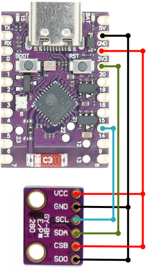

# WeatherstationLight

Ein ESP32-C6 basiertes IoT-Wetterstation-Projekt mit BME280-Sensor und WLAN-Konnektivität.

## Inhaltsverzeichnis

- [Übersicht](#übersicht)
- [Features](#features)
- [Hardware](#hardware)
- [Software](#software)
- [Installation](#installation)
- [Konfiguration](#konfiguration)
- [Verwendung](#verwendung)
- [Projektstruktur](#projektstruktur)
- [Entwicklung](#entwicklung)
- [Versionen](#versionen)
- [Beitragen](#beitragen)
- [Lizenz](#lizenz)

## Übersicht

WeatherstationLight ist eine kompakte, energieeffiziente Wetterstation, die mit dem ESP32-C6 Mikrocontroller entwickelt wurde. Das Projekt kombiniert moderne IoT-Technologien mit präzisen Sensoren zur Überwachung von Umweltbedingungen.

## Features

### Sensoren

- **BME280** - Kombinierter Sensor für:
  - Temperatur (±1°C Genauigkeit)
  - Luftfeuchtigkeit (±3% Genauigkeit)
  - Luftdruck (±1 hPa Genauigkeit)

### Konnektivität

- **WiFi 6 (802.11ax)** - Moderne WLAN-Technologie mit vollständiger Abwärtskompatibilität
- **Hostname:** `WeatherstationLight`
- **Automatische Wiederverbindung** bei Netzwerkausfällen

### Status-Anzeige

- **LED-Indikator** - Visueller Status der Systemfunktionen
- **Serielle Ausgabe** - Detaillierte Logs für Entwicklung und Monitoring

### Technische Features

- **5-Sekunden Boot-Delay** - Zeit für serielle Monitor-Verbindung
- **Modulare Bibliotheks-Architektur** - Wiederverwendbare Komponenten
- **Git-basierte Versionskontrolle** - Saubere Entwicklungshistorie

## Hardware


_Gesamtansicht der WeatherstationLight Hardware_


_BME280 Sensor im Detail_

### Hauptkomponenten

- **ESP32-C6FH4** (QFN32) - Mikrocontroller mit WiFi 6, Bluetooth 5, IEEE 802.15.4
- **BME280** - Umwelt-Sensor (I2C-Schnittstelle)
- **LED** - Status-Indikator
- **USB-C** - Stromversorgung und Programmierung

### Hardware-Spezifikationen

```
Mikrocontroller: ESP32-C6 (RISC-V, 160MHz)
RAM: 320KB
Flash: 4MB (2MB auf diesem Board)
WiFi: 802.11ax (WiFi 6)
Bluetooth: 5.0
IEEE 802.15.4: Unterstützt
```

### Pinout


_GPIO-Pinout des ESP32-C6_


_Pinout des BME280 Sensors_

```
BME280 Sensor:
- VCC → 3.3V
- GND → GND
- SCL → GPIO 14 (I2C Clock)
- SDA → GPIO 20 (I2C Data)
- CSB → 3.3V - I2C Kommunikation
- SDO → GND - Adresse 0x76 verwenden

LED:
- Anode → GPIO 2
- Kathode → GND (über Widerstand)
```

## Software

### Framework

- **ESP-IDF 5.5.0** - Espressif IoT Development Framework
- **PlatformIO** - Entwicklungsumgebung

### Bibliotheken

- **lib/bme280/** - BME280 Sensor-Driver
- **lib/wifi_config/** - WLAN-Konfiguration und -Management

### Programmiersprache

- **C** - Systemnahe Programmierung für maximale Effizienz

## Installation

### Voraussetzungen

- [PlatformIO](https://platformio.org/) installiert
- ESP32-C6 Development Board
- BME280 Sensor
- USB-C Kabel
- Breadport mit Kabel (optional empfohlen)

### Verdrahtung 


_Aufbau der Hardware_
Es ist zu beachten, das es keie Pullup Widerstände für SDA und SCL braucht, da diese intern aktiviert wurden. Sollte die Adresse 0x77 gewünscht sein, kann SDO auf 3.3V gehängt werden.


_Fertige Aufbau_

### Repository klonen

```bash
git clone https://github.com/WindowPlaceBrain/WeatherstationLight.git
cd WeatherstationLight
```

### Abhängigkeiten installieren

```bash
pio lib install
```

### Kompilieren und flashen

```bash
pio run --target upload
```

## Konfiguration

### WLAN-Konfiguration

1. Erstellen Sie die Datei `src/credentials.h`:

```c
#ifndef CREDENTIALS_H
#define CREDENTIALS_H

// WLAN Netzwerk Name (SSID)
#define WIFI_SSID "Ihr-WLAN-Name"

// WLAN Passwort
#define WIFI_PASSWORD "Ihr-WLAN-Passwort"

// Hostname für das ESP32-C6
#define WIFI_HOSTNAME "WeatherstationLight"

// Weitere Konfigurationen...
#define WIFI_CONNECT_TIMEOUT 30
#define WIFI_MAX_RETRY 5

#endif // CREDENTIALS_H
```

### Serieller Monitor

```bash
pio device monitor --baud 115200
```

## Verwendung

### System starten

1. ESP32-C6 mit USB-C verbinden
2. Serieller Monitor starten (optional)
3. System startet automatisch und verbindet sich mit WLAN

### Ausgabe-Beispiel

```
I (5000) WEATHERSTATION: ESP32-C6 WeatherstationLight gestartet
I (5496) WIFI_CONFIG: Setze Hostname: WeatherstationLight
I (5496) WIFI_CONFIG: Hostname erfolgreich gesetzt: WeatherstationLight
I (5496) WIFI_CONFIG: WLAN erfolgreich verbunden!
I (12096) WEATHERSTATION: WLAN Status: VERBUNDEN
I (12096) WEATHERSTATION: BME280 Messung:
I (12096) WEATHERSTATION:   Temperatur: 23.45 °C
I (12096) WEATHERSTATION:   Luftdruck:  1013.25 hPa
I (12096) WEATHERSTATION:   Luftfeuchtigkeit: 65.30 %
```

### LED-Indikator

- **Blinken** - System läuft normal
- **Alle 10 Blinks** - BME280-Messung und WLAN-Status werden angezeigt

## Projektstruktur

```
WeatherstationLight/
├── lib/                          # Bibliotheken
│   ├── bme280/                   # BME280 Sensor-Driver
│   │   ├── bme280.h
│   │   ├── bme280.c
│   │   └── CMakeLists.txt
│   └── wifi_config/              # WLAN-Konfiguration
│       ├── wifi_config.h
│       ├── wifi_config.c
│       └── CMakeLists.txt
├── src/                          # Quellcode
│   ├── main.c                    # Hauptprogramm
│   ├── credentials.h             # WLAN-Credentials (gitignore)
│   └── CMakeLists.txt
├── test/                         # Tests
├── .gitignore                    # Git-Ignore-Regeln
├── platformio.ini               # PlatformIO-Konfiguration
├── CMakeLists.txt               # Haupt-CMake-Konfiguration
└── README.md                    # Diese Datei
```

## Entwicklung

### Git-Workflow

```bash
# Feature-Branch erstellen
git checkout -b feature/neue-funktion

# Änderungen committen
git add .
git commit -m "Beschreibung der Änderungen"

# Zurück zu develop
git checkout develop
git merge feature/neue-funktion
```

### Debugging

- **Serieller Monitor:** `pio device monitor --baud 115200`
- **Log-Level:** Konfigurierbar über `esp_log_level_set()`
- **GPIO-Debugging:** LED als visueller Indikator

### Code-Standards

- **Coding Style:** ESP-IDF Standard
- **Kommentare:** Doxygen-kompatibel
- **Error Handling:** Umfassende Fehlerbehandlung mit `esp_err_t`

## Versionen

### v0.4 - README-Dokumentation (Aktuell)

-  Umfassende README-Dokumentation
-  Hardware-Bilder und Pinout-Diagramme
-  Vollständige Installationsanleitung

### v0.3 - WLAN-Funktionalität

-  WiFi 6 Unterstützung
-  Hostname-Konfiguration
-  Automatische Wiederverbindung
-  Modulare Bibliotheks-Architektur

### v0.2 - BME280 Luftfeuchtigkeit korrigiert

-  Luftfeuchtigkeits-Berechnung korrigiert
-  Fehlerbehebung bei Luftdruck Sensor-Kalibrierung

### v0.1 - Initiale Version

-  Grundlegendes ESP32-C6 Setup
-  BME280 Sensor-Integration
-  LED-Status-Indikator

## Entwicklungsumgebung

- **IDE:** VS Code mit PlatformIO Extension
- **Framework:** ESP-IDF 5.5.0
- **Board:** ESP32-C6-DevKitM-1

## Lizenz

Dieses Projekt steht unter der MIT-Lizenz. Siehe `LICENSE` Datei für Details.

## Kontakt

**Entwickler:** Luca Moser  
**Email:** luca.moser.lm3@gmail.com  
**Projekt:** WeatherstationLight - ESP32-C6 IoT Wetterstation

---

_Entwickelt mit Liebe für das Internet der Dinge_
